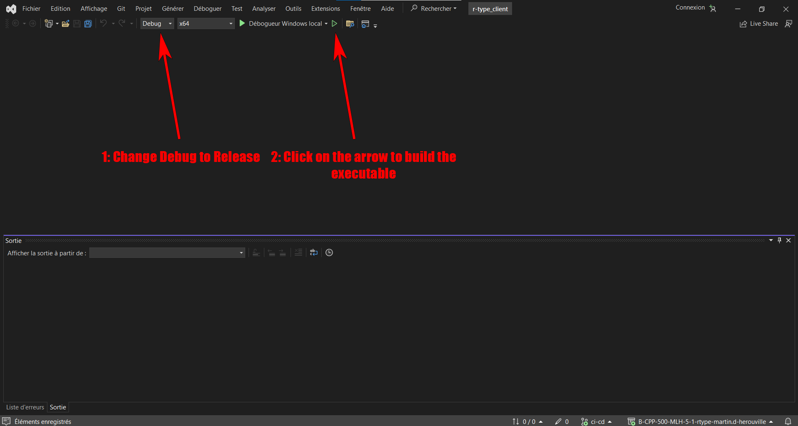

<div align="center">
    <h1 align="center">
        Installation
    </h1>
</div>

## Description

Building a game like R-Type from its source code is a complex process that requires specific configuration and steps. Here's a brief description of the general steps to build the R-Type game from its source code:

### Step 1: Prerequisites

Before you begin, ensure that you have all the necessary prerequisites installed on your system. This may include:

- A C/C++ development environment (such as g++ for Linux or Visual Studio for Windows).
- [CMake](https://cmake.org/).
- The necessary low-level and platform-specific graphical or sound system libraries such as [OpenGL](https://www.opengl.org/) and X11 on Linux.

### Step 2: Download the Source Code

Make sure you have access to the R-Type game's source code. You can typically download it from a Git repository using the command:

```bash
git clone git@github.com:EpitechPromo2026/B-CPP-500-MLH-5-1-rtype-martin.d-herouville.git
cd B-CPP-500-MLH-5-1-rtype-martin.d-herouville.git
git submodule init
git submodule update
```

These commands will get all the source code from the game and init all the necessary dependencies for the good of the project.

### Step 3: Build Configuration

To build the different build tools we have scripts who make the job.

On Linux, run this command:

```bash
./build_project.sh
```

It create the necessary files in the build folder in client and server.

To run the server and the client on Linux, I will redirect you to the [Usage](./README.md#usage) section in the README.

If you are on Windows let's run de .sln file that the CMake just generated.

In the client\build folder:

```bash
r-type_client.sln
```
In the server\build folder:

```bash
r-type_server.sln
```

Visual Studio will open like this:




